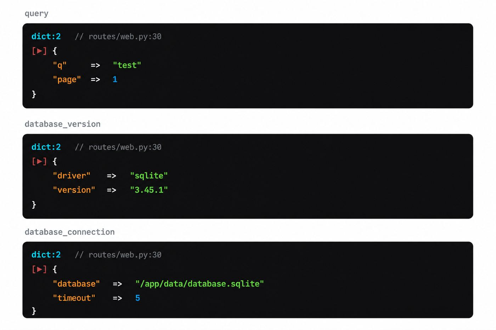
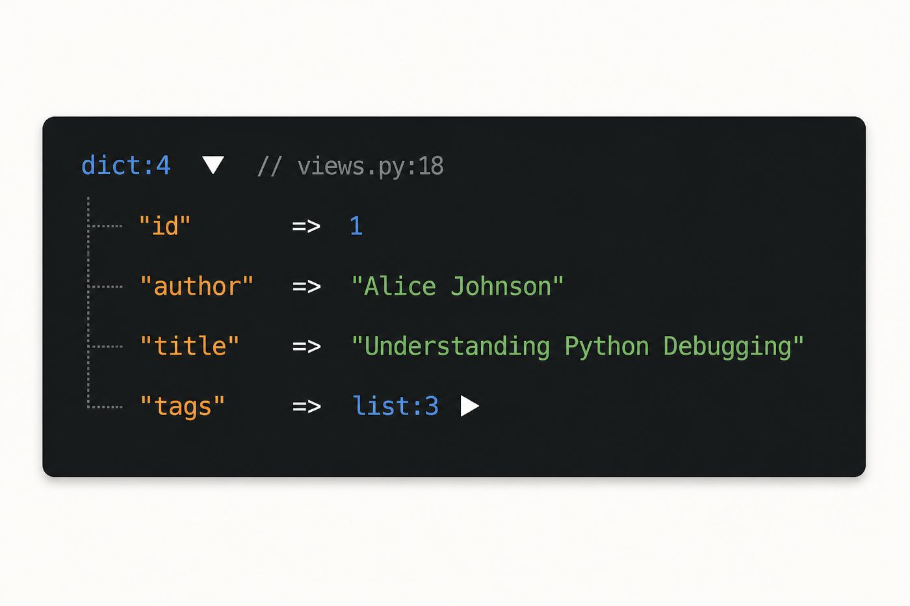
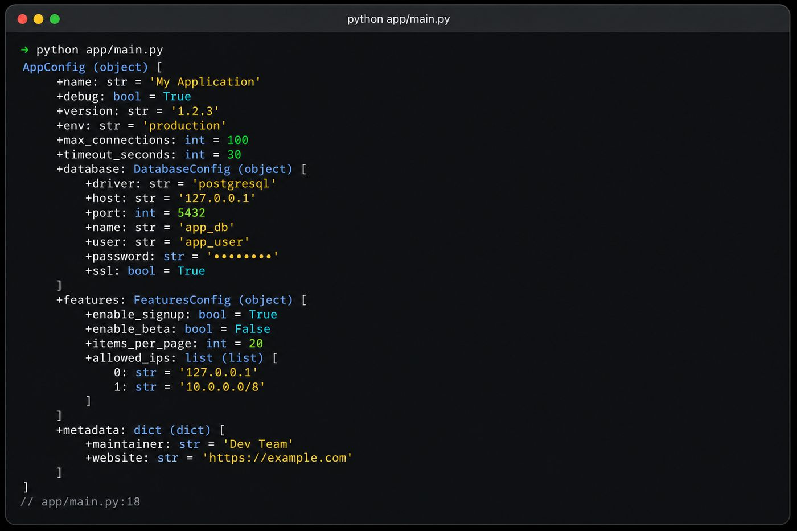

# pydd

**دامپ و توقف برای اپ‌های وب پایتون.** در درخواست HTTP خروجی HTML در مرورگر؛ در بقیه جاها خروجی ترمینال.

بر پایه **[pydump](https://pypi.org/project/pydump-dd/)** — هستهٔ دامپ ترمینال.

<figure class="shot" markdown>

<figcaption>دامپ تعاملی HTML — FastAPI / Flask / Django</figcaption>
</figure>

## فریم‌ورک‌ها

به بخش راه‌اندازی استک خود بروید:

<div class="grid cards fw-cards" markdown>

-   [{ .fw-logo }](frameworks/fastapi.md)

    **[FastAPI](frameworks/fastapi.md)**

    خودکار با `import pydd`

-   [{ .fw-logo }](frameworks/flask.md)

    **[Flask](frameworks/flask.md)**

    `install_flask(app)`

-   [{ .fw-logo }](frameworks/django.md)

    **[Django](frameworks/django.md)**

    `PyddMiddleware`

</div>

<div class="grid cards" markdown>

-   :material-download:{ .lg .middle } **نصب**

    ---

    `pip install pydd-web`

    [:octicons-arrow-right-24: راهنمای نصب](installation.md)

-   :material-rocket-launch:{ .lg .middle } **شروع سریع**

    ---

    در چند دقیقه `dd()` را به یک route در FastAPI اضافه کنید.

    [:octicons-arrow-right-24: شروع سریع](getting-started.md)

-   :material-language-python:{ .lg .middle } **PyPI**

    ---

    نام بسته: **`pydd-web`**

    [:octicons-link-external-24: pydd-web در PyPI](https://pypi.org/project/pydd-web/)

-   :material-github:{ .lg .middle } **گیت‌هاب**

    ---

    سورس، issue و مشارکت.

    [:octicons-link-external-24: ardavanshamroshan/pydd](https://github.com/ardavanshamroshan/pydd)

</div>

## مثال سریع

```python
import pydd  # dd/dump به builtins + patch خودکار FastAPI

@app.get("/posts/{post_id}")
def show_post(post_id: int):
    post = load_post(post_id)
    dd(post)   # HTML با کد 500 در مرورگر — بدون from-import
```

Import صریح هم ممکن است: `from pydd import dd, dump, render_html, render_text`.

## پیش‌نمایش زنده

<figure class="shot" markdown>

<figcaption>چند متغیر — پنل‌های برچسب‌دار در مرورگر</figcaption>
</figure>

<figure class="shot" markdown>

<figcaption>هدر تایپ‌شده، درخت قابل باز شدن، محل فراخوانی</figcaption>
</figure>

<figure class="shot" markdown>

<figcaption>خارج از HTTP — همان داده با pydump در ترمینال</figcaption>
</figure>

## pydd چه می‌کند

| زمینه | رفتار |
|-------|--------|
| داخل درخواست HTTP | دامپ **HTML** تعاملی → پاسخ **500** |
| CLI / اسکریپت / تست | دامپ **ترمینال** با pydump → `SystemExit(1)` |
| `dd(fastapi_app)` هنگام boot | **آماده‌سازی** HTML روی هر درخواست؛ سرور زنده می‌ماند |

## pydump در مقابل pydd

| نیاز | بسته | نام PyPI |
|------|------|----------|
| اسکریپت، CLI، تست | [pydump](https://ardavanshamroshan.github.io/pydump/) | `pydump-dd` |
| FastAPI / Flask / Django | **pydd** (این بسته) | `pydd-web` |
| هر دو | فقط **pydd** نصب کنید | `pydump-dd` هم نصب می‌شود |

## مجوز

MIT — [مخزن گیت‌هاب](https://github.com/ardavanshamroshan/pydd).
